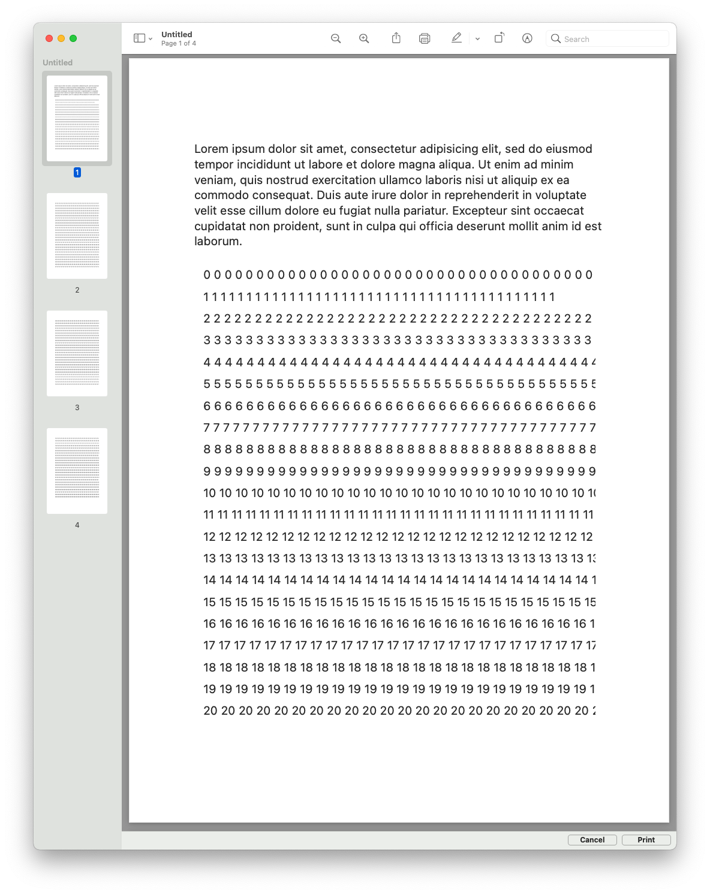

# NSTableView Printing Test

This is a demo project so you can check out how printing a table could work. 

The goal here is to show tabular data on screen, and add text for print-outs.

<table>
<tr>
<td> <small>Print dialog</small></td>
<td> <small>PDF result</small></td>
</tr>
</table>

## Discussion

`NSView`-based printing is a bit odd since it prints whatever `NSView.draw(_:)` produces. We can customzie that by overriding the `draw` method. But for a table view? Embedding a stock standard table view in a custom view hierarchy sounds more promising.

To add a multi-line label on page, we cannot use the stock view-based printing options since the label is not part of the view hierarchy. We need to set up our own view hierarchy with all the to-be-printed views.

For the simple page layout used here, I picked a vertical `NSStackView`. This can be printed via `NSPrintOperation(view: stackView)` and then showing the print dialog for that. 

For complex floating layouts, a `NSTextView` with an attributed string and maybe even a custom `NSLayoutManager` might be necessary. That's how you could, in theory, get text wrapped around images or small tables like Pages does it. 

Actually recommended by other devs: use `WKWebView` and HTML. WebKit does a great job with complex layouts; just look at Safari. Then you can export the web view's content as PDF, and then use the PDF data for the print dialog directly. 

See my accompanying blog post for details and a recap:  
<https://christiantietze.de/posts/2021/06/printing-nstableview-with-label/>

## License

This code is in the Public Domain. Do what you want with it.
